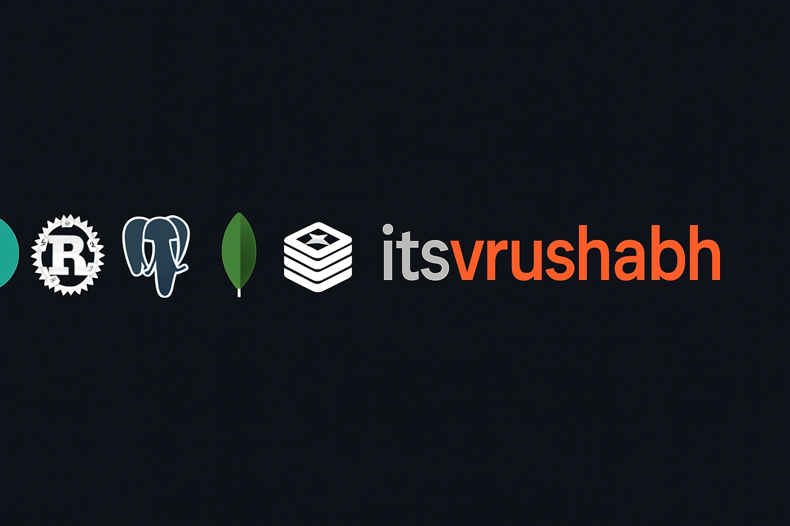

  

    

  

  # 👋 Hey, I'm Vrushabh

  **Backend Developer | API Designer | Rust Enthusiast**

  I’m passionate about building scalable, fast, and reliable backend systems. Whether it’s designing clean REST APIs, optimizing database connection pools, or deploying distributed services with Docker — I enjoy working across the stack to deliver resilient backend solutions.

  
  
  

 

- 🔧 Building high-throughput services with **Rust**, **Python**, **PostgreSQL**, **Redis**, and **Docker**
- 🌱 Exploring: Advanced Rust, Tokio concurrency patterns, and distributed systems architecture
- 🧪 Obsessed with performance benchmarks, type safety, and clean code

---

  <h2>⚙️ Tech Stack</h2>

  <h3>Languages</h3>
  
  

  <h3>Frameworks & Runtimes</h3>
  
  
  
  

  <h3>Databases & Caching</h3>
  
  
  
  
  
  

  <h3>Infrastructure & Messaging</h3>
  
  

  <h3>Editors</h3>
  
  
  
  

  <h3>OS & Workflow</h3>
  
  
  

---

  <h2>📊 GitHub Activity & Streak</h2>

  

    

  <picture>
    <source media="(prefers-color-scheme: dark)" srcset="https://raw.githubusercontent.com/itsvrushabh/itsvrushabh/output/github-contribution-grid-snake-dark.svg" />
    <source media="(prefers-color-scheme: light)" srcset="https://raw.githubusercontent.com/itsvrushabh/itsvrushabh/output/github-contribution-grid-snake.svg" />
    
  </picture>

---

## 📌 Projects & Deep Dives

Check out my **Pinned Repositories** on this profile for active flagship projects. For deeper dives and the full index, explore below:

| Section | Description | Link |
| :--- | :--- | :---: |
| 📚 **Complete Repository Catalog** | Categorized list of all open-source repositories, forks, and tools | [**View Catalog →**](./docs/REPOSITORIES.md) |
| 📐 **Architecture & Stack Notes** | Design principles, concurrency models, and preferred system topology | [**Read Architecture →**](./docs/ARCHITECTURE.md) |

---

 

  

  <h2>🤝 Connect with me</h2>
  
  
  
  

---
> ⚡ Fun Fact: I love building backend systems that *just work* — fast, fault-tolerant, and future-proof.
