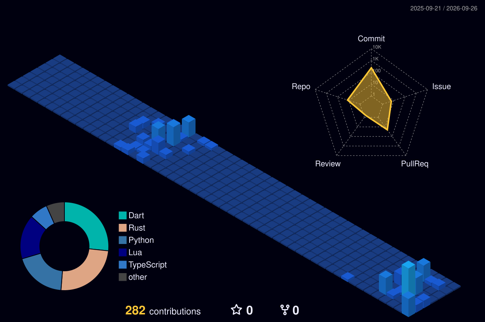
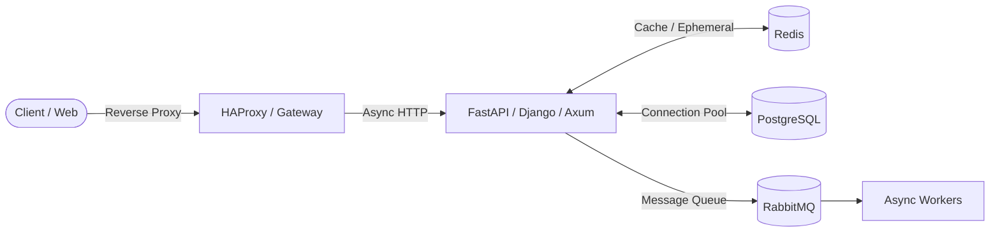

  <!-- 🖥️ Workstation & Dotfiles Setup -->
  

    
    
    
    
  

  ⚡ Daily Driver: <b>Omarchy Linux</b> + <b>Hyprland</b> · Dotfiles: <a href="https://github.com/itsvrushabh/nvim"><b>nvim (LazyVim)</b></a> · <a href="https://github.com/itsvrushabh/tmux"><b>tmux (Omarchy theme)</b></a>

   

  

    
<b>🖥️ Click to inspect Workstation Ergonomics & Dotfiles Specs</b>

     
    

| Layer | Technology | Key Features & Architecture |
| :--- | :--- | :--- |
| **Operating System** | [**Omarchy Linux**](https://omarchy.org/) | Rolling-release Arch base with Linux 6.12+ `sched-ext` user-space scheduler for ultra-low latency response. |
| **Compositor / WM** | [**Hyprland**](https://hyprland.org/) | Hardware-accelerated Wayland tiling compositor, tear-free gaming/display protocol, Tokyo Night palette. |
| **Editor** | [**Neovim (LazyVim)**](https://github.com/itsvrushabh/nvim) | Configured with `rust-analyzer`, `pyright`, Treesitter syntax parsing, and native LSP inlay hints. |
| **Multiplexer** | [**Tmux**](https://github.com/itsvrushabh/tmux) | Custom Omarchy Tokyo Night statusline, extended xterm key handling (`Ctrl+Shift`), session persistence. |
| **Workstation Scripts**| [**tonarchy**](https://github.com/itsvrushabh/tonarchy) | Automated system provisioning, sound, keymaps, and desktop workflow helpers. |

    

  

   

  <picture>
    <source media="(prefers-color-scheme: dark)" srcset="https://raw.githubusercontent.com/itsvrushabh/itsvrushabh/output/github-contribution-grid-snake-dark.svg" />
    <source media="(prefers-color-scheme: light)" srcset="https://raw.githubusercontent.com/itsvrushabh/itsvrushabh/output/github-contribution-grid-snake.svg" />
    
  </picture>

  # 👋 Hey, I'm Vrushabh

  **Backend Developer | API Designer | Rust Enthusiast**

  I’m passionate about building scalable, fast, and reliable backend systems. Whether it’s designing clean REST APIs, optimizing database connection pools, or deploying distributed services with Docker — I enjoy working across the stack to deliver resilient backend solutions.

 

  <h2>⚙️ Tech Stack</h2>

  
<b>Languages, Runtimes, Infra & Tools</b>

  
  
    
  
<b>Databases & Caching</b>

  

    
  Also working with <b>Tokio</b>, <b>Axum</b>, <b>Iced</b>, <b>Turso</b>, and <b>Tmux</b> · <a href="./docs/ARCHITECTURE.md">Read Architecture & Stack Notes →</a>

---

<!-- START_LANGUAGE_RADAR -->
## 🔬 Language Radar: Python & Rust Evolution
*Tracking cutting-edge runtime shifts, compiler internals, and upcoming language proposals.*

 

### 🐍 Python Track

  
  &nbsp;&nbsp;&nbsp;&nbsp;
  

 

| Release | Architectural Focus | Top 3 Core Innovations |
| :--- | :--- | :--- |
| **🟢 Current: 3.14** | Typing & Metaprogramming | 1. **Deferred Annotations (PEP 649):** Type hints evaluated lazily on demand without runtime cost. 2. **Template Strings (PEP 750):** Native `t-strings` for injection-safe, structured templating. 3. **Tier-2 JIT Optimizations:** Micro-op tracing and deep interpreter tail-call speedups. |
| **🚀 Next: 3.15** | Subinterpreters & JIT Maturity | 1. **Standard Free-Threading Stability:** Full ecosystem C-extension stabilization for No-GIL. 2. **Advanced Tier-2 Trace JIT:** Native machine-code generation for hot instruction traces. 3. **Zero-Cost Exception Refinements:** Near-zero overhead for try/except blocks on happy paths. |

 

### 🦀 Rust Track

  
  &nbsp;&nbsp;&nbsp;&nbsp;
  

 

| Release | Systems Focus | Top 3 Core Innovations |
| :--- | :--- | :--- |
| **🟢 Current: 1.98 / 2024** | Concurrency & Ergonomics | 1. **Async Closures:** Ergonomic borrow capturing across await points in `async |x|`. 2. **Let Chains:** Flattened conditional matching (`if let Some(x) = opt && x > 0`). 3. **`gen` Blocks & Yield:** First-class coroutine iterators without handwritten state machine boilerplate. |
| **🚀 Next: 1.99+** | Memory Safety & Expressiveness | 1. **Async Drop:** Automated asynchronous destructor cleanup for sockets and DB transactions. 2. **Dyn Trait Upcasting:** Native sub-to-super trait coercion without manual wrapper shims. 3. **Advanced Const Generics:** Compile-time evaluations and arbitrary expressions in types. |

 

  📡 <i>Tracking frameworks, databases, and infra too?</i> <a href="./docs/TECH_RADAR.md"><b>Explore the Full-Stack Tech Radar (All 16+ Technologies) →</b></a>

<!-- END_LANGUAGE_RADAR -->

 

  <h2>📊 GitHub Activity & Language Distribution</h2>

  
  &nbsp;&nbsp;
  

    

  <picture>
    <source media="(prefers-color-scheme: dark)" srcset="./profile-3d-contrib/profile-night-view.svg" />
    <source media="(prefers-color-scheme: light)" srcset="./profile-3d-contrib/profile-green-animate.svg" />
    
  </picture>

---

  <h2>🌟 Featured Flagship Projects</h2>
  
Production boilerplates, asynchronous state engines, and distributed messaging architectures.

  
  &nbsp;
  
  
    

  
  &nbsp;
  

 

---

## 📐 Engineering Philosophy & System Design

* ⚡ **Zero-Allocation Critical Paths:** Leveraging Rust and Axum/Tokio when sub-millisecond throughput and deterministic memory consumption are paramount.
* 🛡️ **Resilient Distributed State:** Multi-node RabbitMQ message brokering, Redis cache-aside strategies, and robust connection pooling (`asyncpg`, `sqlx`).
* 🔒 **Strict Type Contracts:** End-to-end type safety from compile-time borrow checks in Rust to Pydantic runtime models and PEP 649 annotations in Python.

---

## 📌 Projects & Deep Dives

Check out my **Pinned Repositories** on this profile for active flagship projects. For deeper dives and the full index, explore below:

| Section | Description | Link |
| :--- | :--- | :---: |
| 📡 **Full-Stack Tech Radar** | Current & upcoming versions + top 3 innovations across all 16+ tools | [**View Tech Radar →**](./docs/TECH_RADAR.md) |
| 📚 **Complete Repository Catalog** | Categorized list of all open-source repositories, forks, and tools | [**View Catalog →**](./docs/REPOSITORIES.md) |
| 📐 **Architecture & Stack Notes** | Design principles, concurrency models, and preferred system topology | [**Read Architecture →**](./docs/ARCHITECTURE.md) |

---

 

  

  <h2>🤝 Connect with me</h2>
  
  
  
  

    
  

---
> ⚡ Fun Fact: I love building backend systems that *just work* — fast, fault-tolerant, and future-proof.
