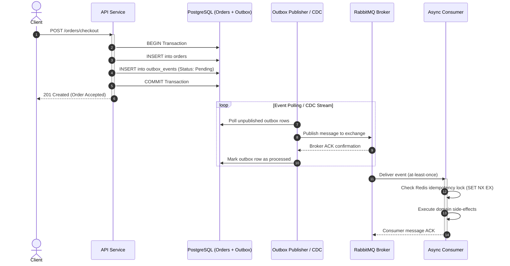

In distributed architectures, keeping state consistent across multiple independent microservices is a fundamental challenge. Network partitions happen, services crash mid-transaction, and message queues will occasionally deliver duplicate payloads.

Here are the concrete patterns and defensive techniques I use to build robust distributed architectures using **RabbitMQ** for durable message queues and **Redis** for low-latency cache-aside synchronization.

---

## The Dual-Write Problem

A common anti-pattern in event-driven systems is writing to a relational database and publishing an event to a message broker in an uncoordinated block:

```python
# ⚠️ ANTI-PATTERN: Dual Write Vulnerability
async def complete_checkout(order_id: str, db, broker):
    # 1. Update database
    await db.execute("UPDATE orders SET status = 'COMPLETED' WHERE id = :id", {"id": order_id})
    
    # 2. What happens if the process crashes or network fails RIGHT HERE?
    await broker.publish("orders.completed", {"order_id": order_id})
```

If the node crashes between step 1 and 2, the order is marked completed in the database, but no downstream inventory or notification services will ever hear about it.

### The Solution: The Transactional Outbox Pattern

Rather than publishing directly to RabbitMQ, store the event in an `outbox` table within the same ACID database transaction:

```sql
BEGIN;
UPDATE orders SET status = 'COMPLETED' WHERE id = 'ord_123';

INSERT INTO outbox_events (event_id, aggregate_type, aggregate_id, payload, created_at)
VALUES (gen_random_uuid(), 'ORDER', 'ord_123', '{"status":"COMPLETED"}', NOW());
COMMIT;
```

A dedicated CDC (Change Data Capture) or high-frequency poller reads unpublished outbox rows, transmits them to RabbitMQ, and marks them processed only upon receiving a broker ACK.



---

## Idempotent Message Consumers

RabbitMQ guarantees **at-least-once** delivery when manual ACKs and persistent queues are enabled. This means your consumer must be idempotent: handling the same event multiple times must produce the exact same outcome without side effects.

Using Redis for atomic de-duplication locks:

```python
import aioredis
from typing import Optional

class IdempotentConsumer:
    def __init__(self, redis_pool: aioredis.Redis):
        self.redis = redis_pool

    async def process_event(self, event_id: str, payload: dict) -> bool:
        # Atomic lock with 24-hour expiration
        acquired = await self.redis.set(
            f"processed:event:{event_id}",
            "1",
            ex=86400,
            nx=True  # Only set if key does not exist
        )

        if not acquired:
            # Duplicate event detected, skip execution safely
            return False

        # Execute business logic
        await self.apply_business_logic(payload)
        return True

    async def apply_business_logic(self, payload: dict):
        pass
```

---

## Cache-Aside & Cache Invalidation

When pairing PostgreSQL with Redis, the standard **Cache-Aside** strategy remains the most reliable:

1. Application checks Redis for the key.
2. If cache hit, return immediately.
3. If cache miss, read from primary PostgreSQL instance.
4. Populate Redis with a randomized TTL (e.g., `300s + rand(0, 30s)`) to prevent cache stampedes.
5. On database write, invalidate (delete) the Redis key rather than updating it in place to eliminate race conditions between concurrent writers.

---

## Summary Checklist

- [x] Eliminate direct dual-writes via the Transactional Outbox.
- [x] Protect consumers with atomic Redis idempotency keys (`SET NX EX`).
- [x] Add jitter to cache TTLs to protect your databases against stampedes.
- [x] Monitor RabbitMQ dead-letter exchanges (DLX) for unprocessable poison messages.
