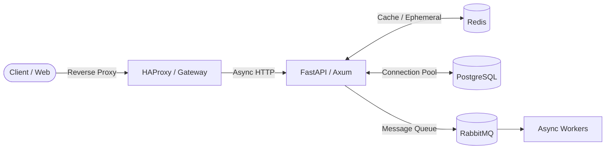

# 📐 Backend Architecture & Engineering Philosophy

Notes on my technical approach, architectural preferences, and design principles when building backend systems.

---

## 🎯 Core Principles

1. **Type Safety & Correctness First**
   * Leverage compile-time guarantees (Rust's borrow checker & strong type system, Python type hints with Pydantic) to catch regressions before runtime.
2. **Predictable Concurrency & Low Latency**
   * Async runtime awareness (Tokio event loops, Python `asyncio`). Avoid blocking runtime threads; offload heavy CPU work to background workers or dedicated threads.
3. **Resilient Data Layer**
   * Asynchronous connection pooling over ad-hoc connections (`asyncpg`, `sqlx`).
   * Cache-aside strategy using Redis with strict TTLs and invalidation policies.
   * Decoupled asynchronous task queues using RabbitMQ to handle burst traffic smoothly.

---

## 🛠️ Preferred Topology

* **Core Languages:** Rust, Python
* **Frameworks & Runtimes:** Axum, Tokio, FastAPI, Iced
* **Databases & Caching:** PostgreSQL, MySQL, SQLite, Turso, Redis, MongoDB
* **Messaging & Brokers:** RabbitMQ
* **Infrastructure & Ops:** Docker, Docker Compose, Git
* **Workstation & OS:** Omarchy Linux, Hyprland (Wayland compositor)
* **Terminal & Multiplexer:** Tmux (with Omarchy Tokyo Night theme)
* **Editors:** Neovim (LazyVim), VS Code, VSCodium, Sublime Text 4

---

[← Back to Profile Overview](../README.md)
